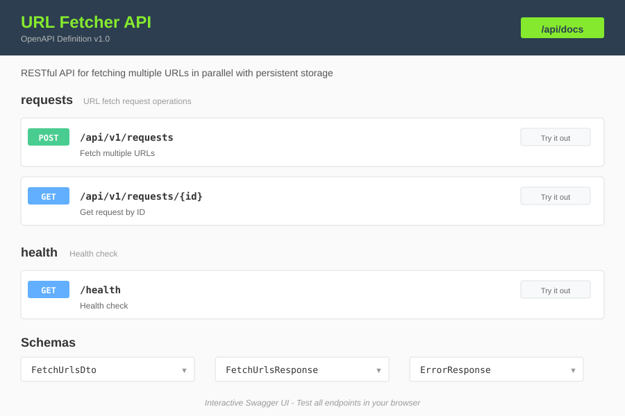

# URL Fetcher API

RESTful API for fetching multiple URLs in parallel with persistent storage.

---

## Quick Start

```bash
# Install
npm install

# Run
npm run start:dev

# Access API
http://localhost:3000
```

## What It Does

> **💡 Tip:** Start the server and visit [http://localhost:3000/api/docs](http://localhost:3000/api/docs) to explore the full interactive API documentation!

### Fetch Multiple URLs

Send multiple URLs, get back detailed results for each:

- HTTP status code
- Response content
- Fetch time
- Redirect information
- Error details (if failed)

### Store and Retrieve

All requests are automatically stored and can be retrieved later by ID.

### Smart Processing

- **Parallel fetching** - All URLs fetched simultaneously
- **Continues on failure** - One failed URL doesn't stop others
- **Follows redirects** - Automatically handles up to 5 redirects
- **Handles timeouts** - 10-second timeout per request
- **Prevents memory issues** - Content truncated at 10MB

---

## 📖 Swagger Documentation

**The complete interactive API documentation is available at:**

### **[http://localhost:3000/api/docs](http://localhost:3000/api/docs)**



## API Endpoints

### 1. Fetch URLs

```http
POST /api/v1/requests
Content-Type: application/json

{
  "urls": [
    "https://www.google.com",
    "https://www.github.com"
  ]
}
```

**Response (201 Created):**

```json
{
  "requestId": "550e8400-e29b-41d4-a716-446655440000",
  "results": [
    {
      "url": "https://www.google.com",
      "status": 200,
      "content": "<!DOCTYPE html>...",
      "contentType": "text/html; charset=utf-8",
      "contentLength": 15234,
      "fetchTime": 145,
      "redirectCount": 0,
      "timestamp": "2024-01-15T10:30:00.543Z"
    },
    {
      "url": "https://www.github.com",
      "status": 200,
      "content": "<!DOCTYPE html>...",
      "contentType": "text/html; charset=utf-8",
      "contentLength": 22451,
      "fetchTime": 198,
      "redirectCount": 1,
      "finalUrl": "https://github.com/",
      "timestamp": "2024-01-15T10:30:00.741Z"
    }
  ],
  "totalUrls": 2,
  "successfulFetches": 2,
  "failedFetches": 0,
  "totalFetchTime": 343,
  "timestamp": "2024-01-15T10:30:00.886Z"
}
```

### 2. Get Request by ID

```http
GET /api/v1/requests/:id
```

**Response (200 OK):**

```json
{
  "id": "550e8400-e29b-41d4-a716-446655440000",
  "urls": ["https://www.google.com", "https://www.github.com"],
  "result": { ... },
  "createdAt": "2024-01-15T10:30:00.000Z",
  "status": "completed"
}
```

**Response (404 Not Found):**

```json
{
  "statusCode": 404,
  "message": "Request not found with ID: invalid-id",
  "error": "Not Found"
}
```

### 3. Health Check

```http
GET /health
```

**Response (200 OK):**

```json
{
  "status": "ok",
  "timestamp": "2024-01-15T10:30:00.543Z",
  "uptime": 3600.5,
  "service": "URL Fetcher Service",
  "version": "1.0.0"
}
```

---

## Validation Rules

The API enforces the following validations:

| Rule                   | Description                  | Error Example                                   |
| ---------------------- | ---------------------------- | ----------------------------------------------- |
| **Non-empty**    | At least 1 URL required      | `URLs array cannot be empty`                  |
| **Max limit**    | Maximum 50 URLs per request  | `Maximum 50 URLs allowed per request`         |
| **Unique**       | No duplicate URLs            | `Duplicate URL found at index 2: https://...` |
| **Valid format** | Must be valid http/https URL | `Invalid URL at index 1: not-a-valid-url`     |

All validation errors include the specific index and value for easy debugging.

---

## Configuration

Create a `.env` file:

```bash
# Server
PORT=3000

# Storage (false = memory, true = file)
IS_PERSISTENT=false
STORAGE_DIR=./storage

# Limits
MAX_URLS_PER_REQUEST=50
```

### Storage Options

| Mode             | Setting                 | Best For             | Persistence       |
| ---------------- | ----------------------- | -------------------- | ----------------- |
| **Memory** | `IS_PERSISTENT=false` | Development, Testing | Lost on restart   |
| **File**   | `IS_PERSISTENT=true`  | Production, Demos    | Survives restarts |

---

## Usage Examples

### cURL

```bash
# Fetch URLs
curl -X POST http://localhost:3000/api/v1/requests \
  -H "Content-Type: application/json" \
  -d '{"urls": ["https://www.google.com", "https://www.github.com"]}'

# Get by ID
curl http://localhost:3000/api/v1/requests/550e8400-e29b-41d4-a716-446655440000
```

### JavaScript/TypeScript

```javascript
// Fetch URLs
const response = await fetch('http://localhost:3000/api/v1/requests', {
  method: 'POST',
  headers: { 'Content-Type': 'application/json' },
  body: JSON.stringify({
    urls: ['https://www.google.com', 'https://www.github.com']
  })
});

const result = await response.json();
console.log('Request ID:', result.requestId);

// Get by ID
const saved = await fetch(
  `http://localhost:3000/api/v1/requests/${result.requestId}`
);
const request = await saved.json();
```

### Python

```python
import requests

# Fetch URLs
response = requests.post(
    'http://localhost:3000/api/v1/requests',
    json={'urls': ['https://www.google.com', 'https://www.github.com']}
)
result = response.json()

# Get by ID
request = requests.get(
    f'http://localhost:3000/api/v1/requests/{result["requestId"]}'
).json()
```

---

## Error Handling

The API gracefully handles various error scenarios:

| Error Type                   | Description                | Example                   |
| ---------------------------- | -------------------------- | ------------------------- |
| **Timeout**            | Request exceeds 10 seconds | `timeout exceeded`      |
| **Domain Not Found**   | DNS resolution fails       | `getaddrinfo ENOTFOUND` |
| **Connection Refused** | Server not responding      | `connect ECONNREFUSED`  |
| **HTTP Errors**        | 4XX or 5XX status codes    | `404 Not Found`         |
| **Network Errors**     | General failures           | `Network error`         |

Failed URLs are included in the response with error details. Successful URLs still return results.

**Example with failures:**

```json
{
  "requestId": "...",
  "results": [
    {
      "url": "https://www.google.com",
      "status": 200,
      "content": "...",
      "fetchTime": 145
    },
    {
      "url": "https://nonexistent-domain-xyz.com",
      "error": "Domain not found",
      "fetchTime": 2000
    }
  ],
  "totalUrls": 2,
  "successfulFetches": 1,
  "failedFetches": 1,
  "totalFetchTime": 2145
}
```

---

## Testing

```bash
# Unit tests (24 tests)
npm test

# E2E tests (6 tests)
npm run test:e2e

# All tests
npm run test:all

# With coverage
npm run test:cov
```

**Test Coverage:** 30 tests, 100% passing ✅

---

## 📚 Documentation

### Interactive Swagger UI

All API documentation is available through an interactive Swagger interface:

**👉 [http://localhost:3000/api/docs](http://localhost:3000/api/docs)**

The Swagger UI provides:

- Complete endpoint documentation
- Request/response schemas
- Live API testing ("Try it out" buttons)
- Validation rules and constraints
- Error response examples
- Data models and examples

### OpenAPI Specification

The raw OpenAPI specification is available at: [openapi.yaml](./openapi.yaml)

---

## Appendix

### Architecture

```
┌─────────────────┐
│   Controllers   │  REST endpoints (HTTP layer)
└────────┬────────┘
         │
┌────────▼────────┐
│    Services     │  Business logic (URL fetching)
└────────┬────────┘
         │
┌────────▼────────┐
│  Repositories   │  Data access (memory/file)
└─────────────────┘
```

### Tech Stack

| Component               | Technology       |
| ----------------------- | ---------------- |
| **Framework**     | NestJS           |
| **Language**      | TypeScript       |
| **HTTP Client**   | Axios            |
| **Testing**       | Jest + Supertest |
| **Documentation** | Swagger/OpenAPI  |
| **Validation**    | class-validator  |

### Project Structure

```
src/
├── controllers/           # REST endpoints
│   ├── url-fetcher.controller.ts
│   └── health.controller.ts
├── services/             # Business logic
│   └── url-fetcher.service.ts
├── repositories/         # Data access
│   ├── requests.repository.interface.ts
│   ├── memory-requests.repository.ts
│   ├── file-requests.repository.ts
│   └── repositories.module.ts
├── dto/                  # Data transfer objects
│   └── fetch-urls.dto.ts
├── interfaces/           # TypeScript interfaces
│   └── url-fetch-result.interface.ts
├── validators/           # Validation logic
│   └── url.validator.ts
└── app.module.ts         # Root module
```

**Building for production:**

```bash
npm run build
npm run start:prod
```

### License

ISC
